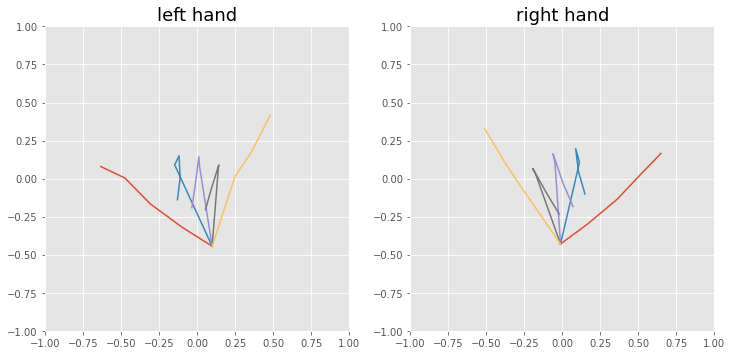

[](https://youtu.be/FK-1G749cIo "Hand gesture classification | OpenHand")

[**Watch full video here!**](https://youtu.be/FK-1G749cIo)


# 🤙 OpenHand model design
**For a better visualization of this notebook, please use Google Colab**

<a href="https://colab.research.google.com/github/ArthurFDLR/OpenHand-Models/blob/main/OpenHand-Models.ipynb" target="_parent"></a>


This Notebook can be used to create Neural Network classifiers running in the [OpenHand application](https://github.com/ArthurFDLR/OpenHand-App).


First, we have to import several libraries to visualize our dataset and create a new model.


```python
# Visualization tools 
from IPython.display import display, HTML, Markdown
from google.colab import widgets

%matplotlib inline
from matplotlib import pylab
import matplotlib.pyplot as plt
import matplotlib.patches as mpatches
from matplotlib.lines import Line2D
plt.style.use('ggplot')

# Computation tools 
from pathlib import Path
import numpy as np
import os
import pandas as pd
pd.set_option('display.max_columns', None)
pd.set_option('display.min_rows', 5)

%tensorflow_version 2.x
import tensorflow
from tensorflow import keras

print('Available GPU:')
!nvidia-smi -L
print('\nTensorFlow use GPU at: {}'.format(tensorflow.test.gpu_device_name()))
```

    Available GPU:
    GPU 0: Tesla T4 (UUID: GPU-51d5ac3f-2cff-1a5e-cd46-c12b64020977)
    
    TensorFlow use GPU at: /device:GPU:0
    

## Dataset exploration


While OpenHand already contains a basic dataset, you can easily create and import your own using the application!


```python
dataset_df = pd.read_csv("https://raw.githubusercontent.com/ArthurFDLR/OpenHand-App/master/Dataset/OpenHand_dataset.csv")
labels = dataset_df.label.unique()

display(Markdown("## Complete dataset view"))
display(dataset_df)

display(Markdown("## Number of samples per label and hand"))
df_hand_labels = {hand_i : dataset_df.loc[dataset_df['hand'] == hand_i].groupby('label') for hand_i in ['left', 'right']}
display(
    pd.DataFrame(
        [df.size() for df in df_hand_labels.values()],
        columns=labels,
        index=df_hand_labels.keys(),
        )
)
```


### Complete dataset view


<table border="1" class="dataframe">
  <thead>
    <tr style="text-align: right;">
      <th></th>
      <th>label</th>
      <th>hand</th>
      <th>accuracy</th>
      <th>x0</th>
      <th>y0</th>
      <th>x1</th>
      <th>y1</th>
      <th>x2</th>
      <th>y2</th>
      <th>x3</th>
      <th>y3</th>
      <th>x4</th>
      <th>y4</th>
      <th>x5</th>
      <th>y5</th>
      <th>x6</th>
      <th>y6</th>
      <th>x7</th>
      <th>y7</th>
      <th>x8</th>
      <th>y8</th>
      <th>x9</th>
      <th>y9</th>
      <th>x10</th>
      <th>y10</th>
      <th>x11</th>
      <th>y11</th>
      <th>x12</th>
      <th>y12</th>
      <th>x13</th>
      <th>y13</th>
      <th>x14</th>
      <th>y14</th>
      <th>x15</th>
      <th>y15</th>
      <th>x16</th>
      <th>y16</th>
      <th>x17</th>
      <th>y17</th>
      <th>x18</th>
      <th>y18</th>
      <th>x19</th>
      <th>y19</th>
      <th>x20</th>
      <th>y20</th>
    </tr>
  </thead>
  <tbody>
    <tr>
      <th>0</th>
      <td>0</td>
      <td>left</td>
      <td>15.139381</td>
      <td>0.403383</td>
      <td>-0.366229</td>
      <td>0.194999</td>
      <td>-0.361383</td>
      <td>-0.013385</td>
      <td>-0.264461</td>
      <td>-0.149077</td>
      <td>-0.162692</td>
      <td>-0.216922</td>
      <td>-0.060923</td>
      <td>0.083538</td>
      <td>-0.002769</td>
      <td>-0.027923</td>
      <td>0.195922</td>
      <td>-0.173307</td>
      <td>0.094153</td>
      <td>-0.207230</td>
      <td>0.002077</td>
      <td>0.136845</td>
      <td>0.036000</td>
      <td>-0.042462</td>
      <td>0.200768</td>
      <td>-0.153923</td>
      <td>0.079615</td>
      <td>-0.178153</td>
      <td>-0.027000</td>
      <td>0.199845</td>
      <td>0.045692</td>
      <td>0.010846</td>
      <td>0.195922</td>
      <td>-0.095769</td>
      <td>0.079615</td>
      <td>-0.120000</td>
      <td>-0.012462</td>
      <td>0.257999</td>
      <td>0.040846</td>
      <td>0.131999</td>
      <td>0.137769</td>
      <td>0.015692</td>
      <td>0.113538</td>
      <td>-0.057000</td>
      <td>0.036000</td>
    </tr>
    <tr>
      <th>1</th>
      <td>0</td>
      <td>left</td>
      <td>14.065027</td>
      <td>0.333266</td>
      <td>-0.430984</td>
      <td>0.169325</td>
      <td>-0.368800</td>
      <td>0.016691</td>
      <td>-0.255737</td>
      <td>-0.152903</td>
      <td>-0.142674</td>
      <td>-0.226394</td>
      <td>-0.040918</td>
      <td>0.186284</td>
      <td>-0.006999</td>
      <td>0.022344</td>
      <td>0.106063</td>
      <td>-0.113331</td>
      <td>0.100410</td>
      <td>-0.124638</td>
      <td>0.043879</td>
      <td>0.231509</td>
      <td>0.049532</td>
      <td>-0.005922</td>
      <td>0.145635</td>
      <td>-0.135944</td>
      <td>0.094757</td>
      <td>-0.203782</td>
      <td>0.004307</td>
      <td>0.208897</td>
      <td>0.038226</td>
      <td>0.016691</td>
      <td>0.168248</td>
      <td>-0.118985</td>
      <td>0.111716</td>
      <td>-0.147250</td>
      <td>0.038226</td>
      <td>0.191937</td>
      <td>0.004307</td>
      <td>0.027997</td>
      <td>0.151288</td>
      <td>-0.062453</td>
      <td>0.128676</td>
      <td>-0.113331</td>
      <td>0.060838</td>
    </tr>
    <tr>
      <th>...</th>
      <td>...</td>
      <td>...</td>
      <td>...</td>
      <td>...</td>
      <td>...</td>
      <td>...</td>
      <td>...</td>
      <td>...</td>
      <td>...</td>
      <td>...</td>
      <td>...</td>
      <td>...</td>
      <td>...</td>
      <td>...</td>
      <td>...</td>
      <td>...</td>
      <td>...</td>
      <td>...</td>
      <td>...</td>
      <td>...</td>
      <td>...</td>
      <td>...</td>
      <td>...</td>
      <td>...</td>
      <td>...</td>
      <td>...</td>
      <td>...</td>
      <td>...</td>
      <td>...</td>
      <td>...</td>
      <td>...</td>
      <td>...</td>
      <td>...</td>
      <td>...</td>
      <td>...</td>
      <td>...</td>
      <td>...</td>
      <td>...</td>
      <td>...</td>
      <td>...</td>
      <td>...</td>
      <td>...</td>
      <td>...</td>
      <td>...</td>
      <td>...</td>
    </tr>
    <tr>
      <th>11202</th>
      <td>Ok</td>
      <td>right</td>
      <td>16.430834</td>
      <td>-0.262744</td>
      <td>-0.477646</td>
      <td>-0.070791</td>
      <td>-0.408216</td>
      <td>0.100741</td>
      <td>-0.355123</td>
      <td>0.215096</td>
      <td>-0.314281</td>
      <td>0.268190</td>
      <td>-0.253020</td>
      <td>0.031312</td>
      <td>-0.085572</td>
      <td>0.190592</td>
      <td>-0.048815</td>
      <td>0.255937</td>
      <td>-0.126413</td>
      <td>0.255937</td>
      <td>-0.244852</td>
      <td>-0.038118</td>
      <td>-0.020226</td>
      <td>0.059900</td>
      <td>0.179895</td>
      <td>0.137498</td>
      <td>0.306502</td>
      <td>0.198760</td>
      <td>0.408605</td>
      <td>-0.132053</td>
      <td>-0.024310</td>
      <td>-0.111632</td>
      <td>0.179895</td>
      <td>-0.066707</td>
      <td>0.310586</td>
      <td>-0.038118</td>
      <td>0.412689</td>
      <td>-0.213735</td>
      <td>-0.065151</td>
      <td>-0.262744</td>
      <td>0.106381</td>
      <td>-0.262744</td>
      <td>0.208484</td>
      <td>-0.254576</td>
      <td>0.310586</td>
    </tr>
    <tr>
      <th>11203</th>
      <td>Ok</td>
      <td>right</td>
      <td>15.640315</td>
      <td>-0.258065</td>
      <td>-0.478518</td>
      <td>-0.070381</td>
      <td>-0.404227</td>
      <td>0.105572</td>
      <td>-0.353396</td>
      <td>0.211144</td>
      <td>-0.318205</td>
      <td>0.273705</td>
      <td>-0.259554</td>
      <td>0.043011</td>
      <td>-0.071871</td>
      <td>0.203324</td>
      <td>-0.040590</td>
      <td>0.246334</td>
      <td>-0.130522</td>
      <td>0.265885</td>
      <td>-0.251734</td>
      <td>-0.039101</td>
      <td>-0.013220</td>
      <td>0.058651</td>
      <td>0.182284</td>
      <td>0.140763</td>
      <td>0.303496</td>
      <td>0.199414</td>
      <td>0.409068</td>
      <td>-0.132942</td>
      <td>-0.021040</td>
      <td>-0.113392</td>
      <td>0.182284</td>
      <td>-0.074291</td>
      <td>0.303496</td>
      <td>-0.043011</td>
      <td>0.409068</td>
      <td>-0.226784</td>
      <td>-0.067961</td>
      <td>-0.261975</td>
      <td>0.107992</td>
      <td>-0.265885</td>
      <td>0.209654</td>
      <td>-0.261975</td>
      <td>0.303496</td>
    </tr>
  </tbody>
</table>
<p>11204 rows × 45 columns</p>
</div>


### Number of samples per label and hand

<table border="1" class="dataframe">
  <thead>
    <tr style="text-align: right;">
      <th></th>
      <th>0</th>
      <th>1</th>
      <th>2</th>
      <th>3</th>
      <th>4</th>
      <th>5</th>
      <th>6</th>
      <th>7</th>
      <th>8</th>
      <th>9</th>
      <th>Chef</th>
      <th>Help</th>
      <th>Super</th>
      <th>VIP</th>
      <th>Water</th>
      <th>Metal</th>
      <th>Dislike</th>
      <th>Loser</th>
      <th>Phone</th>
      <th>Shaka</th>
      <th>Stop</th>
      <th>Spoke</th>
      <th>PowerFist</th>
      <th>Horns</th>
      <th>FightFist</th>
      <th>MiddleFinger</th>
      <th>Ok</th>
    </tr>
  </thead>
  <tbody>
    <tr>
      <th>left</th>
      <td>207</td>
      <td>201</td>
      <td>213</td>
      <td>203</td>
      <td>204</td>
      <td>206</td>
      <td>208</td>
      <td>202</td>
      <td>241</td>
      <td>221</td>
      <td>205</td>
      <td>235</td>
      <td>203</td>
      <td>202</td>
      <td>207</td>
      <td>208</td>
      <td>205</td>
      <td>206</td>
      <td>201</td>
      <td>203</td>
      <td>202</td>
      <td>205</td>
      <td>209</td>
      <td>204</td>
      <td>204</td>
      <td>209</td>
      <td>205</td>
    </tr>
    <tr>
      <th>right</th>
      <td>208</td>
      <td>207</td>
      <td>203</td>
      <td>205</td>
      <td>213</td>
      <td>206</td>
      <td>202</td>
      <td>202</td>
      <td>205</td>
      <td>209</td>
      <td>206</td>
      <td>209</td>
      <td>208</td>
      <td>221</td>
      <td>204</td>
      <td>214</td>
      <td>206</td>
      <td>205</td>
      <td>204</td>
      <td>208</td>
      <td>204</td>
      <td>206</td>
      <td>211</td>
      <td>207</td>
      <td>203</td>
      <td>201</td>
      <td>208</td>
    </tr>
  </tbody>
</table>
</div>


```python
colors = ["r", "y", "g", "b", "m"]

display(Markdown("## Mean sample visualization"))
tb = widgets.TabBar(list(labels))
for i, label_i in enumerate(labels):
    # Only select the first 3 tabs, and render others in the background.
    with tb.output_to(i, select=(i < 3)):
        fig, axs = pylab.subplots(1, 2, figsize=(12,6))
        for ax, hand_visualization in zip(axs, ['left', 'right']):
            sample_data = dataset_df[(dataset_df.label==label_i) & (dataset_df.hand==hand_visualization)].drop(['label', 'hand', 'accuracy'], axis=1).to_numpy().mean(axis=0)
            sample_data_2D = np.stack([sample_data[::2], sample_data[1::2]])

            sample_fingers = [
                sample_data_2D[:, 0:5],
                np.insert(sample_data_2D[:, 5:9].T, 0, sample_data_2D[:, 0], axis=0).T,
                np.insert(sample_data_2D[:, 9:13].T, 0, sample_data_2D[:, 0], axis=0).T,
                np.insert(sample_data_2D[:, 13:17].T, 0, sample_data_2D[:, 0], axis=0).T,
                np.insert(sample_data_2D[:, 17:21].T, 0, sample_data_2D[:, 0], axis=0).T,
            ]
            for finger, c in zip(sample_fingers, colors):
                ax.plot(finger[0], finger[1])
            ax.set_xlim([-1,1])
            ax.set_ylim([-1,1])
            ax.set_aspect("equal")
            ax.set_title('{} hand'.format(hand_visualization), fontdict={'size':18})
        fig.show()
```


### *Shaka* mean sample visualization





### Create NumPy arrays

Now that we know what the dataset looks like, we can create NumPy arrays to train TensorFlow models. We are only using samples associated with the right hand. However, you can easily use the whole dataset to train a single neural network through hands vertical symmetry.


```python
hand_label = 'right'
test_split = 0.15

# Find the minimum number of samples accross categories to uniformly distributed sample sets
total_size_cat = df_hand_labels[hand_label].size().min()
test_size_cat  = int(total_size_cat*test_split)
train_size_cat = total_size_cat - test_size_cat

x_train = []
x_test  = []
y_train = []
y_test  = []

# Iterate over each labeled group
for label, group in df_hand_labels[hand_label]:
    # remove irrelevant columns
    group_array = group.drop(['label', 'hand', 'accuracy'], axis=1).to_numpy()
    np.random.shuffle(group_array)
    
    x_train.append(group_array[:train_size_cat])
    y_train.append([label]*train_size_cat)
    x_test.append(group_array[train_size_cat : train_size_cat+test_size_cat])
    y_test.append([label]*test_size_cat)

# Concatenate sample sets as numpy arrays and shuffle in unison
shuffler_test = np.random.permutation(test_size_cat*len(labels))
shuffler_train = np.random.permutation(train_size_cat*len(labels))
x_train = np.concatenate(x_train, axis=0)[shuffler_train]
x_test = np.concatenate(x_test, axis=0)[shuffler_test]
y_train = np.concatenate(y_train, axis=0)[shuffler_train]
y_test = np.concatenate(y_test, axis=0)[shuffler_test]

# One-hot encoding
y_train_onehot = keras.utils.to_categorical([list(labels).index(sample) for sample in y_train])
y_test_onehot  = keras.utils.to_categorical([list(labels).index(sample) for sample in y_test])

display(HTML('''There are {n_cat} categories with a minimum of {min} samples for the {hand} hand,
                Given a training/test split ratio of {split}% on uniformly distributed sets,
                the training set has {n_train} samples and the test set has {n_test} samples:'''
             .format(hand=hand_label, n_cat=len(labels), min=total_size_cat, split=test_split*100, n_train=x_train.shape[0], n_test=x_test.shape[0])))
display(pd.DataFrame([str(d.shape) for d in (x_train, x_test, y_train, y_test, y_train_onehot, y_test_onehot)],
                     index = ['x_train', 'x_test', 'y_train', 'y_test', 'y_train_onehot', 'y_test_onehot'],
                     columns = ['shape']))
```


There are 27 categories with a minimum of 201 samples for the right hand,
                Given a training/test split ratio of 15.0% on uniformly distributed sets,
                the training set has 4617 samples and the test set has 810 samples:


<table border="1" class="dataframe">
  <thead>
    <tr style="text-align: right;">
      <th></th>
      <th>shape</th>
    </tr>
  </thead>
  <tbody>
    <tr>
      <th>x_train</th>
      <td>(4617, 42)</td>
    </tr>
    <tr>
      <th>x_test</th>
      <td>(810, 42)</td>
    </tr>
    <tr>
      <th>y_train</th>
      <td>(4617,)</td>
    </tr>
    <tr>
      <th>y_test</th>
      <td>(810,)</td>
    </tr>
    <tr>
      <th>y_train_onehot</th>
      <td>(4617, 27)</td>
    </tr>
    <tr>
      <th>y_test_onehot</th>
      <td>(810, 27)</td>
    </tr>
  </tbody>
</table>
</div>


## Models exploration


This section is optional. The following blocks can be used to compare different model architecture and training processes.

**[Open in Google Colab for details.](https://colab.research.google.com/github/ArthurFDLR/OpenHand-Models/blob/main/OpenHand-Models.ipynb)**
    


## Model export

Once you have a good model, you can save it on your Google Drive. The model is saved using the [folder hierarchy of OpenHand](https://github.com/ArthurFDLR/OpenHand-App#pose-classifier-models).


```python
from google.colab import drive

from pathlib import Path


content_path = Path('/').absolute() / 'content'

drive_path = content_path / 'drive'

drive.mount(str(drive_path))
``` 


```python
model = keras.models.Sequential(name = '27Class_3x64',
                                   layers =
    [
        keras.layers.Input(shape=x_train.shape[1]),
        keras.layers.Dense(64, activation=keras.activations.relu),
        keras.layers.Dense(64, activation=keras.activations.relu),
        keras.layers.Dense(64, activation=keras.activations.relu),
        keras.layers.Dense(len(labels), activation=keras.activations.softmax),
    ]
)

model.summary()
model.compile(
    optimizer=keras.optimizers.Adam(),
    loss='categorical_crossentropy',
    metrics=['accuracy'],
)

save_path = drive_path / 'My Drive'
for subfolder in ['OpenHand', 'Models', model.name]:
    save_path /= subfolder
    if not (save_path).is_dir():
        %mkdir "{save_path}"
    

model_path = save_path / '{name}_{hand}.h5'.format(name = model.name, hand = hand_label)

model.fit(
    x=x_train,
    y=y_train_onehot,
    epochs=10,
    batch_size=4,
    validation_split=0.15,
    shuffle=True,
    callbacks=[keras.callbacks.ModelCheckpoint(filepath=model_path, verbose=1, save_best_only=True)],
    verbose = 2,
)

class_file = open(save_path / 'class.txt', 'w')
for i, label_i in enumerate(labels):
    class_file.write((',' if i!=0 else '') + label_i)
class_file.close()
```

    Model: "27Class_3x64"
    _________________________________________________________________
    Layer (type)                 Output Shape              Param #   
    =================================================================
    dense_15 (Dense)             (None, 64)                2752      
    _________________________________________________________________
    dense_16 (Dense)             (None, 64)                4160      
    _________________________________________________________________
    dense_17 (Dense)             (None, 64)                4160      
    _________________________________________________________________
    dense_18 (Dense)             (None, 27)                1755      
    =================================================================
    Total params: 12,827
    Trainable params: 12,827
    Non-trainable params: 0
    _________________________________________________________________
    Epoch 1/10
    981/981 - 2s - loss: 0.7942 - accuracy: 0.7867 - val_loss: 0.1111 - val_accuracy: 0.9582

    ...

    Epoch 10/10
    981/981 - 2s - loss: 0.0032 - accuracy: 0.9995 - val_loss: 0.0016 - val_accuracy: 1.0000
    
    Epoch 00010: val_loss did not improve from 0.00124
    


```python
model_test = keras.models.load_model(model_path)
model_test.evaluate(x=x_test, y=y_test_onehot)
```

    26/26 [==============================] - 0s 2ms/step - loss: 0.0018 - accuracy: 1.0000
    [0.0018195720622316003, 1.0]
